  

  
  
  

  <b>CS + Maths @ University of Manchester</b> · ex-founding engineer · hackathon addict 
  I like building AI systems that do real work, and shipping them fast enough to demo by morning.

  

## 🏆 Hackathon builds

| | Project | Where | What it does |
|:-:|---|---|---|
| 🥈 | **Brick AI** | Clay × OpenAI Hackathon, London | GTM intelligence platform: a *Market Radar* and *Competitive War Room* built on Clay's MCP + OpenAI models via Codex CLI |
| 🤖 | **[Daddy Agent](https://github.com/Vitalii-Dm/daddy-agent)** | HackUPC 2026, Barcelona | Electron app where you run a team of parallel Claude Code and Codex agents from a kanban board, orchestrated via tmux |
| 🛡️ | **[VITAL](https://github.com/Vitalii-Dm/VITAL)** | HackUPC 2026, Barcelona | WiFi CSI sensing + YOLOv8-Pose that flags medical events for warehouse workers in under 2 s, with no wearables and no faces |
| 🏅 | **[SAVR](https://github.com/Vitalii-Dm/savr)** · [demo](https://savrhackathon.lovable.app/landing) | Great Uni Hack 2025 | Student finance app: anomaly and ghost-subscription detection, gamified savings, and a 3D savings pot |
| 🏅 | **[Rest Quest](https://devpost.com/software/rest-quest)** | Great Uni Hack 2025 | Reads your mood with computer vision, then asks Gemini where you should go on holiday |

SAVR and Rest Quest both placed at the same 24-hour hackathon. 5 hackathon wins so far across London, Barcelona and Dublin.

## 💼 Where I've shipped

- **Founding Engineer · Hugo** (ML platform for cultural research): owned the stack end to end. I built a pgvector RAG pipeline on a versioned JSONB schema, a Neo4j graph layer that lets users *see* how embedded entities connect, and video feature extraction that mixes statistics with LLM pattern detection.
- **Full-stack Developer · TrouDigital**: built a scheduling automation that replaced a **6-person manual workflow** and cut monthly processing **from weeks to minutes**. I also prototyped AI demos for digital-signage clients.

## 🧪 Side quests

- **[Stock_predict](https://github.com/Vitalii-Dm/Stock_predict)**: a screener that turns a "buy before the breakout" method (VCP, trend, fundamentals) into code.
- **[Vibe-Trading-Jev](https://github.com/Vitalii-Dm/Vibe-Trading-Jev)**: an LLM spot trader for OKX, built on top of [HKUDS/Vibe-Trading](https://github.com/HKUDS/Vibe-Trading).
- **Neural nets for PDEs**: a pre-uni research project comparing NN architectures on the heat and wave equations, trading off speed against accuracy.

## 🧰 Toolbox

   
  

+ pgvector · Neo4j · shadcn/ui · LLM tooling (Claude Code, Codex, MCP)

<b>🕹️ Lore</b> (click to expand)

 

- 🇺🇦 Grew up in **Kyiv**, did the IB in **Madrid**, and now I'm in **Manchester**. Four languages: Ukrainian, Russian, English and Spanish.
- 🧮 I was an olympiad kid: silver medal at the **HKIMO final in Hong Kong** and 1st place in the Olimpis CS Olympiad.
- 🥁 Drummer, 🏀 basketball player, ♟️ chess player.
- 🧠 Once shipped two podium projects in a single 24-hour hackathon.

 

  <picture>
    <source media="(prefers-color-scheme: dark)" srcset="https://raw.githubusercontent.com/Vitalii-Dm/Vitalii-Dm/output/snake-dark.svg" />
    <source media="(prefers-color-scheme: light)" srcset="https://raw.githubusercontent.com/Vitalii-Dm/Vitalii-Dm/output/snake-light.svg" />
    
  </picture>

